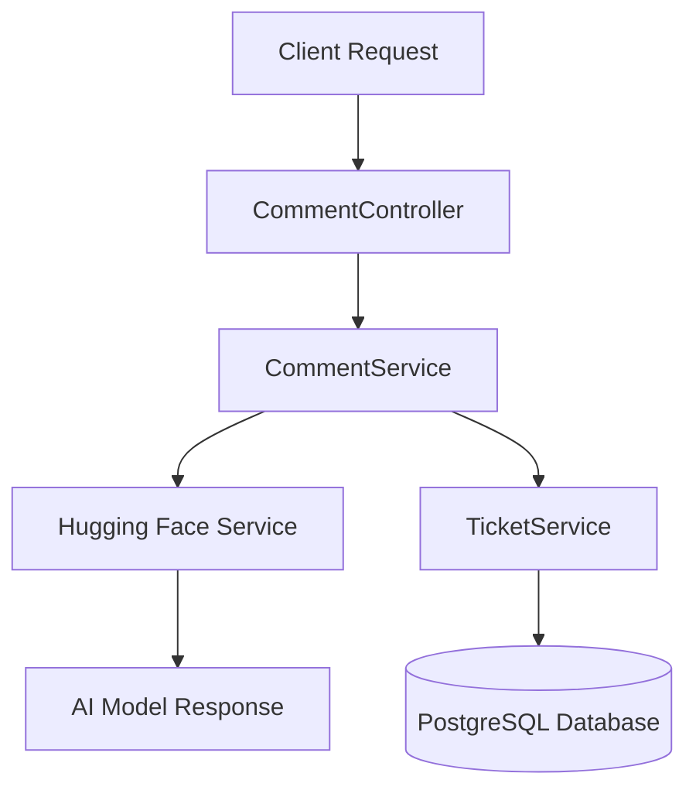

# 📩 Comment to Ticket Triage (Hugging Face AI)

A Spring Boot REST API that accepts inbound messages/comments, analyzes them using Hugging Face AI, and automatically creates support/lead tickets when the message qualifies.

---

## 🧠 Project Overview

Comment-to-Ticket Triage is an AI-powered backend system that automates customer message handling by transforming unstructured text into structured support tickets.

It integrates **Hugging Face NLP models** to classify messages and determine whether they should be escalated into actionable tickets with assigned category and priority.

This project demonstrates real-world **AI + backend system integration**, similar to production-grade SaaS support systems.

---

## 🚀 Example Scenarios (How It Works)

### 🧾 Scenario 1: Billing Issue → High Priority Ticket

**Input:**
```json
{
  "senderEmail": "john@example.com",
  "content": "I was charged twice for my subscription this month."
}
````

**System Output:**

* Category: BILLING
* Priority: HIGH
* Ticket: Automatically created

---

### 🧾 Scenario 2: Technical Bug → Engineering Ticket

**Input:**

```json
{
  "senderEmail": "alice@example.com",
  "content": "The app crashes every time I try to upload a file."
}
```

**System Output:**

* Category: BUG
* Priority: HIGH
* Ticket: Automatically created

---

### 🧾 Scenario 3: Non-Qualified Message → No Ticket

**Input:**

```json
{
  "senderEmail": "mark@example.com",
  "content": "Thanks for your support, everything is working fine!"
}
```

**System Output:**

* No ticket created
* Message stored only

---

## 🧰 Tech Stack

* Java 21
* Spring Boot
* Spring MVC
* Spring Data JPA
* Jakarta Validation
* PostgreSQL
* Hugging Face Inference API
* Maven Wrapper
* JUnit 5
* Mockito

---

## 📁 Project Structure

```
comment-to-ticket-triage/
├── .mvn/
├── mvnw
├── mvnw.cmd
├── pom.xml
├── .gitattributes
├── src/
│   ├── main/
│   │   ├── java/
│   │   │   └── com.mirkamolcode/
│   │   │       ├── config/
│   │   │       │   ├── HttpClient
│   │   │       │   └── HttpClientConfig
│   │   │       ├── controller/
│   │   │       │   ├── CommentController
│   │   │       │   └── TicketController
│   │   │       ├── dto/
│   │   │       │   ├── api/
│   │   │       │   │   ├── HuggingFaceComment
│   │   │       │   │   ├── HuggingFaceRequest
│   │   │       │   │   └── HuggingFaceResponse
│   │   │       │   ├── AiTicketResponse
│   │   │       │   ├── CommentResponse
│   │   │       │   ├── CreateCommentRequest
│   │   │       │   └── TicketResponse
│   │   │       ├── entity/
│   │   │       │   ├── enums/
│   │   │       │   │   ├── Category
│   │   │       │   │   └── Priority
│   │   │       │   ├── Comment
│   │   │       │   └── Ticket
│   │   │       ├── exception/
│   │   │       │   ├── ApiError
│   │   │       │   ├── GlobalExceptionHandler
│   │   │       │   └── ResourceNotFoundException
│   │   │       ├── repository/
│   │   │       │   ├── CommentRepository
│   │   │       │   └── TicketRepository
│   │   │       ├── service/
│   │   │       │   ├── CommentService
│   │   │       │   ├── HuggingFaceService
│   │   │       │   └── TicketService
│   │   │       └── CommentToTicketTriageApplication
│   │   └── resources/
│   │       ├── static/
│   │       ├── templates/
│   │       └── application.yaml
│   └── test/
│       └── java/
│           └── com.mirkamolcode/
│               ├── service/
│               │   ├── CommentServiceTest
│               │   ├── HuggingFaceServiceTest
│               │   └── TicketServiceTest
│               └── CommentToTicketTriageApplicationTests
```

---

## 🏗️ Architecture Overview



---

## ⚙️ Features

* Create and list inbound messages
* AI-based message analysis using Hugging Face
* Automatic ticket creation for qualified messages
* Ticket categorization by type
* Ticket priority assignment
* PostgreSQL persistence
* Validation and structured error responses
* Unit tests for service layer

---

## 📡 API Endpoints

### Base URL

```
http://localhost:8080/api/v1
```

### 📝 Create Message

```
POST /messages
```

### 📥 Get All Messages

```
GET /messages
```

### 🎫 Get All Tickets

```
GET /leads
```

### 🔍 Get Ticket by ID

```
GET /leads/{id}
```

---

## 🗄️ Database Setup

```sql
CREATE DATABASE comments_db;
```

### Default Configuration

```yaml
spring:
  datasource:
    username: mirkamol
    password:
    url: jdbc:postgresql://localhost:5432/comments_db
```

---

## 🤖 Hugging Face Setup

1. Create Hugging Face account
2. Generate API token
3. Add token to `application.yaml`

```yaml
ai:
  huggingface:
    token: "your_huggingface_token"
```

---

## ▶️ Running the Application

### macOS / Linux

```bash
./mvnw spring-boot:run
```

### Windows

```bash
mvnw.cmd spring-boot:run
```

---

## 🧪 Running Tests

### macOS / Linux

```bash
./mvnw test
```

### Windows

```bash
mvnw.cmd test
```

---

## 📦 Build Project

### macOS / Linux

```bash
./mvnw clean package
```

### Windows

```bash
mvnw.cmd clean package
```

---

## ⚡ Ticket Categories

| Category | Description                 |
| -------- | --------------------------- |
| BUG      | Technical errors or crashes |
| FAILURE  | System failures             |
| BILLING  | Payment issues              |
| ACCOUNT  | Login/access issues         |
| OTHER    | General messages            |

---

## ⚡ Ticket Priorities

| Priority | Meaning        |
| -------- | -------------- |
| LOW      | Minor issue    |
| MEDIUM   | Standard issue |
| HIGH     | Critical issue |

---

## ❗ Validation Rules

* `senderEmail` must be a valid email
* `content` must not be empty

---

## ⚠️ Common Issues

### PostgreSQL connection failed

* Ensure DB is running
* Check credentials

### Hugging Face API error

* Verify token
* Check internet

### Port already in use

```yaml
server:
  port: 8081
```

---
